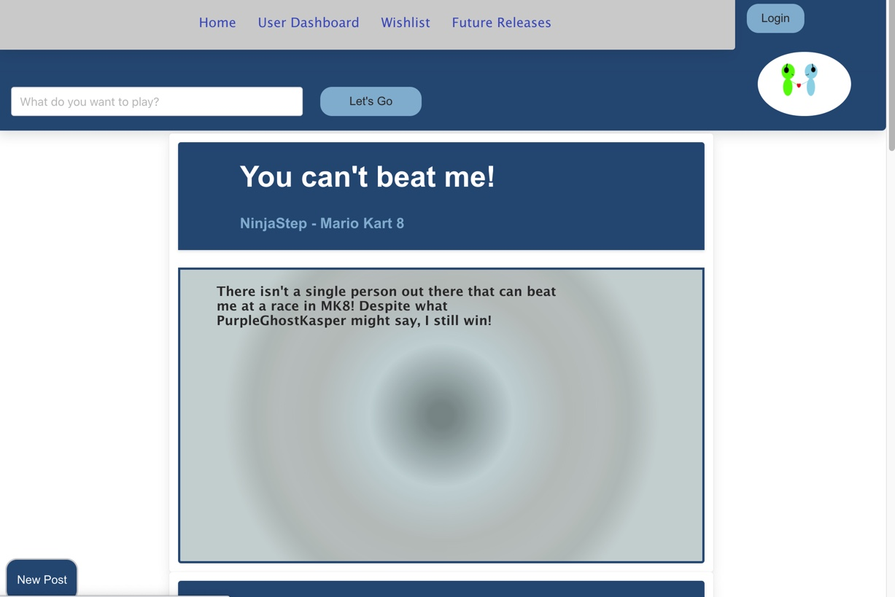
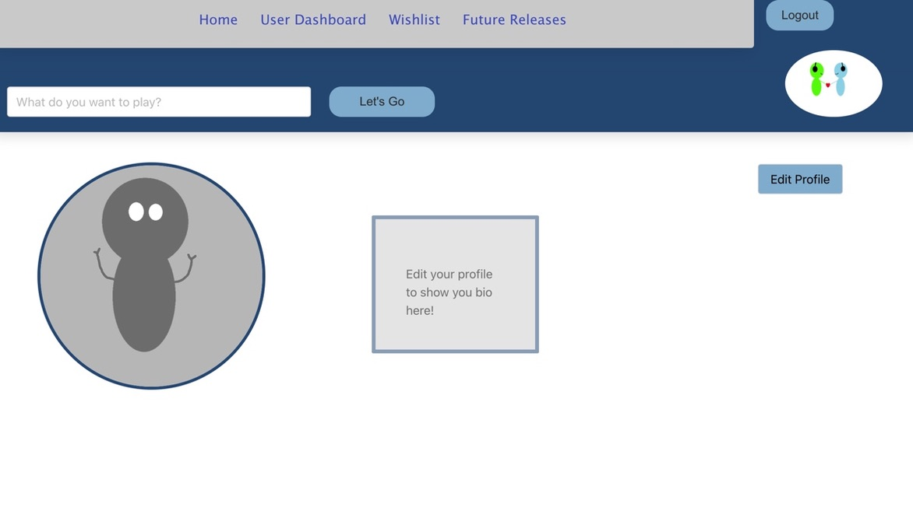
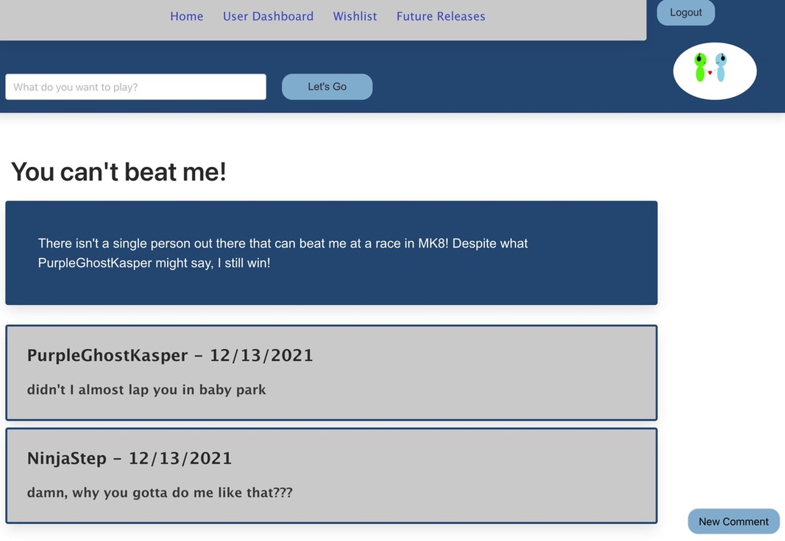

# Gamers-Connect

## Description

In this project, we created a full-stack blog application for gamers to connect and talk about their favorite games. The user is presented with features such as a login/sign-up, a profile page where the user can upload a profile picture and fill out a custom bio, and a blog feature that allows the user to post about games and also leave comments on other blog posts. 

## License:  

## Table of Contents
1. [Description](#description)
2. [Installation](#installation)
3. [Usage](#usage)
4. [Credits](#credits)
5. [Contributing](#contributing)
6. [License](#license)
7. [Questions](#questions)

## Installation

In order for this application to work you will need the node environment and MySql installed on your computer. Adequate instructions for downloading the node environment can be found at nodejs.org. Instructions for downloading MySql can be found at mysql.com. To install all dependencies for this program, start by opening the server.js file in an integrated terminal and run "npm install".

## Usage
1. Make sure all dependencies are installed by running npm install.
2. Source the database by opening the db folder in an integrated terminal, and running mysql -u root -p. You'll need to create a .env file that holds your database name, password and user.
3. Seed the database by running "node seeds/index.js".
4. To start the application open the server.js file in an integrated terminal and run "npm start". The application will be running at http://localhost:3001

### Deployed Site and Images
The deployed website can be found at this link: https://enigmatic-shore-17530.herokuapp.com/

1. Homepage:  
  

2. Profile:  
  

3. Post:  
  

## Credits

### Collabortors
- Ryan Paragas: https://github.com/ParagasR
- Irvin Ruiz: 
- Jessica Kasper: https://github.com/JessicaKasper
- John Gallagher: https://github.com/gallaghj13

### Other Resources
- MDN Web Docs
- npmjs.com
- mysql.com
- VSCode
- StackOverflow

## Contributing

  
For contributing guidelines see link : https://www.contributor-covenant.org/

## License 
This Project is licensed under the MIT license.

* https://opensource.org/licenses/MIT

## Questions

Follow link for github repository: https://github.com/ParagasR/Gamers-Connect  
For any additional questions you can reach me at: gallagherj0913@gmail.com